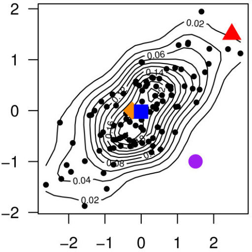

# 2. Distances

### Jaccard distance

$$
JD_{AB}=JD_{BA}=\dfrac{|A\cup B| - |A\cap B|}{|A\cup B|} \qquad = 1-\dfrac{|A\cap B|}{|A\cup B|} \qquad
$$

最后得到一个百分比，数字越小越相似。

### Minkowski distance

 p = 1 is equivalent to the **Manhattan distance.**

 p = 2 is equivalent to the **Euclidean distance.**

### Mahalanobis distance

[https://www.statisticshowto.datasciencecentral.com/mahalanobis-distance/](https://www.statisticshowto.datasciencecentral.com/mahalanobis-distance/)

Euclidean distance with correlation

Formula

