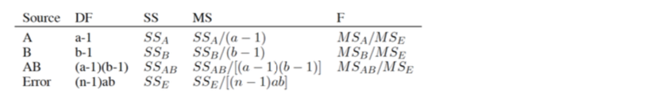
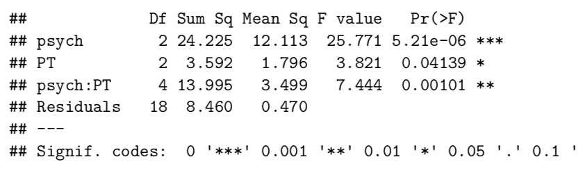
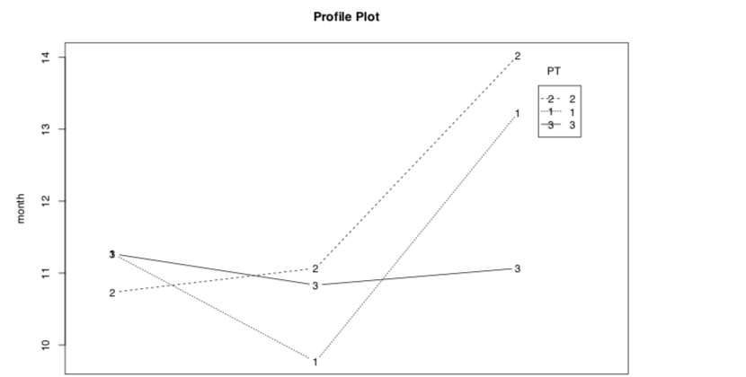

# 3. Factorial Design

## Introduction

**Motivation**

when there is only one factor, we use one-way ANOVA, what if there are more than one factors?

**Factorial Designs are More Efficient**

In a 4 × 4 factorial design with n number of replicates in each group, there are actually 4n replicates for each “marginal” condition of wing length or body width.

Factorial design: 4 x 4 x 1; 

Without FD: 4 x 4 x 4

**\*\*Questions of interest\*\***

1. Are there certain types of physical therapy that are more successful than other physical therapy?
2. Are there certain types of psychiatric therapy that are more successful than other psychiatric therapy?
3. Are there any combination of physical therapy and psychiatric therapy that are more successful?

## Analysis

#### Means

```text
tapply(data$month, data$psych, mean) #marginal mean A
tapply(data$month, data$PT, mean) #marginal mean B
tapply(data$month, list(data$psych, data$PT), mean) #interaction
```

#### ANOVA \(Two factors\)



```text
summary(aov(month ~ psych * PT, data = data))
```



**Hypothesis Testing**

1. H0 : α1 = ... = α4, F test is significant at 5% level, hence there exist significant difference across psychiatric therapies.
2. H0 : β1 = . . . = β6, again, there exists significance difference across physical therapies.
3. There also exist significant interaction effects between the two therapy types.

#### Profile plot

```text
with(data, (interaction.plot(psych, PT, month, type="b", leg.bty="o", 
main="Profile Plot", xlab="pyschiatric therapy", ylab="month")))
```



#### PostHoc Test

```text
mod1 <- aov(month ~ psych * PT, data = data)
PostHocTest(mod1)
```

#### Use contrast to make comparisons: main effects

how to select some groups to compare?

dummy variables: write all the betas and formulas, then you can determine the meaning of betas and formulas of differences

_first, construct contrast_

```text
gamma <- coef(mod1)
c1 <- c2 <- c3 <- rep(0, length(gamma))
c1[4] <- 1 # gamma3
c2[5] <- 1 # gamma5
c3[c(4, 5)] <- c(1, -1) #gamma3-gamma5
```

_method 1: chi square_

```text
Cmat <- rbind(c1, c2, c3)[-1, ] 
# contrast coefficient matr est <- Cmat %*% gamma
COV <- Cmat %*% vcov(mod1) %*% t(Cmat)
Wald <- t(est) %*% solve(COV) %*% est
pchisq(Wald, 2, lower.tail = FALSE)
```

_method 2: `"gmodels"`_

```text
 library(gmodels)
# working with contrast using estimable functions 
Cmat <- rbind(PT1v2 = c1, PT1v3 = c2, PT2v3 = c3) 
estimable(mod1, Cmat)
```

## Balanced FD

#### Definition

Same number of replicates for each marginal condition.

#### Advantage

Under balanced FD, we can summarize the sum of squares and decompose them in terms of main effects and interaction effects very conveniently.

e.g. balanced FD


We can see that the sum sq are the same for the same factor in two models.

e.g. unbalanced FD


We can see that the sum sq are different for the same factor in two models.

To summarize, it is more convinient to decompose the variance if we use balanced FD. In venn plot, balanced design makes the two factors seperated \(treatment assignment is independent\), while non-balanced design makes two factors dependent on each other, also, the results rely on the order of factors.

#### Different Types of SS

* Type I: default e.g. Y~A\*B, calculate SS_A_, then SS_B\|A_, then SS_AB\|A,B_
* Type II: SSA\|B, SSB\|A, assuming no interaction effects
* Type III: SS_A\|B,AB_, SS_B\|A,AB_

```text
library(car)
mod2 <- lm(month ~ psych * PT, data = data2)
Anova(mod2, type = "III")
```


