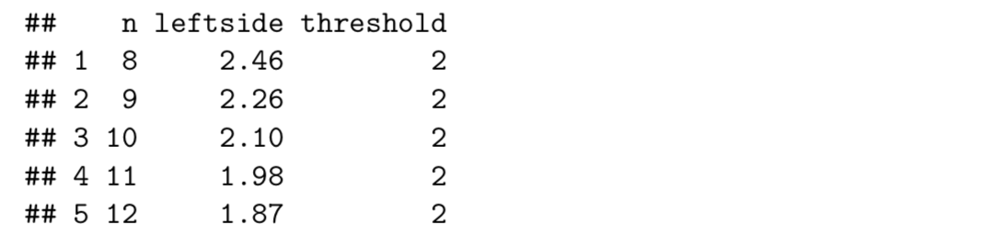

# 4. Power Analysis

## Paired Sample Mean Comparison \(One - Sample t-test\)

pre-test and post-test data for the same sample

### Confidence interval

#### CI Calculation


#### Width


given all the other figures, solve n

e.g.



### Error table

#### Type I error \(alpha\) and Type II error \(beta\)


Test statistics for type I error


Test statistics for type II error


Visualize


### Power = 1 - β

Things that affect power:

1. α: α decreases, β increases, power \(1 − β\) decreases
2. difference in two peaks: effect size and sample size

$$
Diff=(\mu_d-\mu_0)/\sqrt{Var(d)*n},\ \mu_0=0
\\=\frac{\mu_d/\sqrt{Var(d)}}{\sqrt{n}}
$$

$$
Effect\ size  = \mu_d/\sqrt{Var(d)}
$$


#### Formula of n

the formula is derived from z test


```text
# e.g.
dmu <- 1
dS <- var(data$Diff)^0.5
delta <- dmu/dS
n <- ((qnorm(0.8) + qnorm(0.975))/delta)^2 

# or use function
power.t.test(power = 0.8, delta = delta, type = "one.sample")
```

## Power calculation for Two Sample Test


## Power and sample size for F Test


Here is the plot showing central F-distribution and noncentral F-distribution, lambda is noncentrality parameter. The larger the lambda is, the noncentral F-distribution is flatter, and the beta is smaller.


#### Effect Size Caluclation for F test

$$
\lambda = SS_B/\hat\sigma^2=\frac{SS_B}{SS_W/(n-g)}
\\ \\\sigma_m^2=\frac{SS_B}{N},\ \sigma^2=\frac{SS_W}{N-g},\ so\ \lambda=N\frac{\sigma_m^2}{\sigma^2}
\\ effct\ size\ f=\sqrt{\sigma_m/\sigma}, \ \lambda=Nf^2
$$

## Power calculation for Planned Contrast


## Power Analysis for Factorial Design


