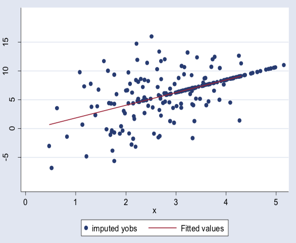

# 4. More complicated imputation

## Regression imputation

when y has missing values:

using regression with complete cases to predict y and impute those missing values in y

```text
Ry = as.numeric(!is.na(y))
data.cc = cbind(x,y)[Ry == 1, ]
data.dropped = cbind(x, y)[Ry == 0, ]
reg = lm(y ~ x, data = data.frame(data.cc))
y.imp = predict(reg, newdata = data.frame(data.dropped))
y[Ry == 0] = y.imp
```

_issues_: SSE decreases, standard error decreases in all MACR, MAR, NMAR scenarios, and get higher correlations



And therefore, we want to create some noises.

## Regression imputation with noise

Based on the above imputation

```text
noise = rnorm(length(y.imp),0,summary(mod)$sigma)
y.imps = y.imp + noise
```

How to stochastically impute for binary data?

2 level: logistic regression

```text
mod = glm(y ~ pred1 + pred2, data = dat.cc, family=“binomial”)
ps = predict(mod, newdata=dat.dropped, type=“response”)
y.imps = rbinom(sum(Ry==0), 1, ps)
```

multi levels: multinomial regression

```text
library(nnet)
mmod = multinom(y ~ pred1 + pred2,data = dat.cc)
ps = predict(mmod, type = "prob", newdata = dat.dropped)

k = 5    # k is the number of categories
nimp = (sum(Ry==0))
cat.imps = numeric(nimp)
for(i in 1:nimp)
{
cat.imps[i] = sum(rmultinom(1, 1, ps[i,])*c(1:k))
}
```

